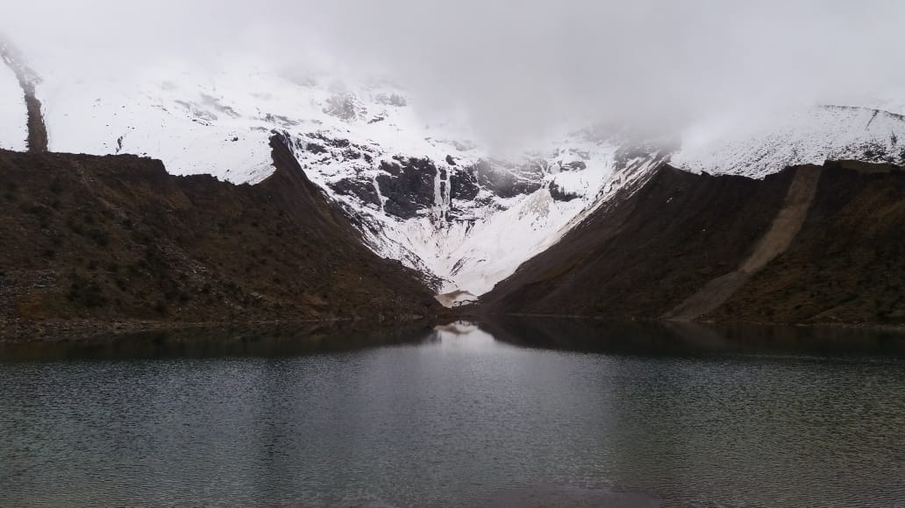
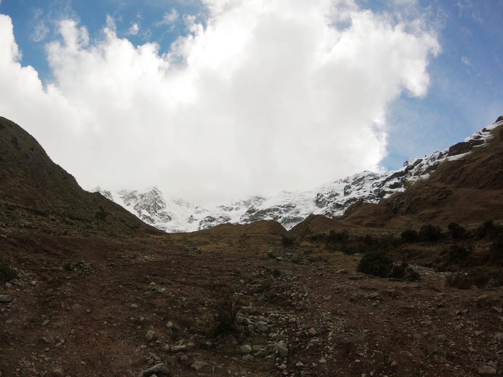

This is a story I keep in my heart 💟 I was on a trip to Peru and I decided to do one of the most popular hikes they have at Cusco: The Humantay lagoon, in the Salkantay mountain 🏔🇵🇪

There are beautiful pics of this place. 🔎 Do a quick google search to find them, because this is the best one I took there 👇️

Pretty bad, right? 💀 Well, I'll tell you why.

I was walking uphill and taking some photos with a GoPro Hero Session 📷 An old version that I love because it's super small. This part is important ℹ️ This camera is quite small 🤏

I saved my camera in a fanny pack after taking every photo 📸 This wasn't the best idea. At a certain moment, I thought the zipper was closed but it wasn't and the tragedy occurred 🙀 I was walking and all the things from my pack dropped to the floor with the bad luck that my camera quickly disappeared down the mountain 💢

The terrain was rough, with a lot of dust, rocks, and bushes 😰 It was impossible to locate the small black cube 😞
My friends told me we have no time for that. Just let's keep going! ⬆️🏃‍♀

I felt really sad and frustrated 😫 I got to the lagoon and took some photos with the poor quality camera of my phone 📱
As you can see in the photo I showed previously ⏮

Well, the quality of the camera was not the reason why I didn't take a great photo in laguna Humantay ✋
When you go there, the trick to capture the blue color in the water is going to a specific place higher than the lagoon 🆙
I had no time for that ⌛️ I couldn't bear the feeling that my camera was not lost, it was there ⬇️ And I needed to find it! 💪

I walked away from my group and returned to the hiking path, trying to remember the place of the tragedy 🤔 Everything looked the same but I finally recognized the place 🧐 This is a picture taken with the camera before the catastrophe 💥

I started walking within a radius from there without success 😣

I remember a local guide who asked me what I was searching for. I couldn't avoid crying 😭 Between tears, I told him I lost my camera. He was riding a horse and helped me for a while, but nothing came up 🐴🤷

In the middle of my anguish, I started to remember when mountain guides say that mountains are magical ⛰✨ When something bad
happens to you in a mountain it's because the mountain did not allow you to be there 🚫 Or simply, it was the mountain's decision 🔮 That's why you should ask permission to her before you start the hike. This is a ritual I love 💚

So, I tried to relax and internally ask the mountain for help 😌 I begged her sincerely please help me to find my camera 🙏

After that, an idea came up to me! 🤯

I grabbed a rock with a similar size to my camera and I dropped it in the same place my camera did 📍 I observed its trajectory 🔭 The rock went pretty far down, in a place I had not searched yet because I didn't think the fall could be that far 🤷‍♀

I followed the trajectory of the rock and when I was near the end of it... BOOM! 🌟 I saw the small black piece inside a bush 👀 WOW! 😳 That was my camera!! 🙌

I can't describe all the sensations I had at that moment 🤩 I felt happy, strong, amazed, but on the top of everything, grateful 👏

You can call it what you want. A coincidence, a stroke of luck. It's ok 👌 You can believe in what makes you feel good 😌
I feel good believing in the magic of every mountain I visit ✨ And this one, in particular, will always remember me the respect they deserve and the power that all of us, nature and humans, have inside 🌎⚡️

